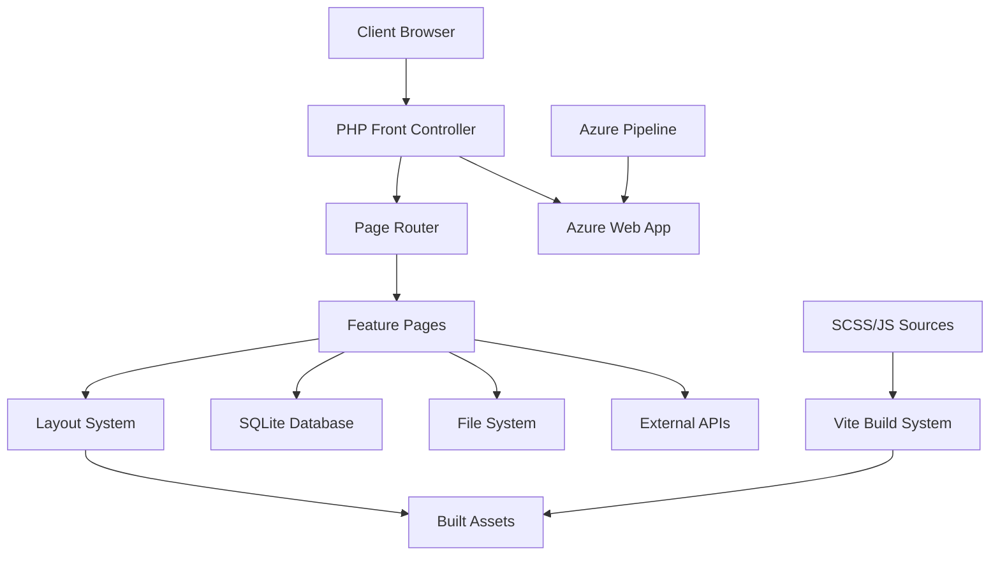

# 🚀 Control Origins Documentation Platform

[](https://controlorigins-docs.azurewebsites.net/)
[](https://php.net)
[](https://nodejs.org)
[](https://vitejs.dev)
[](https://getbootstrap.com)

> **A modern, full-featured PHP documentation platform demonstrating best practices for contemporary web development with hybrid server-side/client-side architecture.**

**Educational Focus**: This project serves as a comprehensive reference implementation for building modern PHP applications with contemporary tooling, showcasing patterns for documentation management, data visualization, API integration, and responsive UI development.

---

## 📋 Table of Contents

- [🎯 Project Overview](#-project-overview)
- [✨ Key Features](#-key-features)
- [🏗️ Architecture](#️-architecture)
- [🔧 Technology Stack](#-technology-stack)
- [🚀 Quick Start](#-quick-start)
- [📁 Project Structure](#-project-structure)
- [🛠️ Development](#️-development)
- [📈 Build System](#-build-system)
- [🧪 Features Showcase](#-features-showcase)
- [🚀 Deployment](#-deployment)
- [📖 Documentation](#-documentation)
- [🤝 Contributing](#-contributing)
- [📊 Performance](#-performance)
- [🔒 Security](#-security)
- [📝 License](#-license)

---

## 🎯 Project Overview

This project demonstrates modern PHP web development practices by building a comprehensive documentation and portfolio platform. It showcases the integration of traditional server-side PHP with contemporary client-side build tools, creating a hybrid architecture that leverages the best of both worlds.

### **Learning Objectives**

- **Modern PHP Development**: PHP 8.2+ features, clean architecture patterns
- **Hybrid Build System**: Vite-powered asset pipeline with PHP backend
- **Content Management**: Markdown-based documentation with full-text search
- **Data Visualization**: Interactive charts and data analysis tools
- **API Integration**: GitHub API, external services, caching strategies
- **Responsive Design**: Bootstrap 5, mobile-first approach
- **DevOps**: Azure Pipelines, automated deployment workflows

### **Target Audience**

- PHP developers exploring modern development workflows
- Full-stack developers interested in hybrid architectures
- Technical writers and documentation maintainers
- Students learning web development best practices
- Teams seeking reference implementations for internal tools

---

## ✨ Key Features

### 🎨 **Frontend Excellence**

- **Modern Build System**: Vite 7.1+ with hot module replacement
- **Responsive Design**: Bootstrap 5.3 with custom SCSS compilation
- **Interactive Components**: DataTables, Chart.js integration
- **Asset Optimization**: Automated minification, compression, source maps

### 📚 **Content Management**

- **Markdown Documentation**: Recursive directory scanning with Parsedown
- **Full-Text Search**: File content indexing with relevance scoring
- **Dynamic Navigation**: Auto-generated menus from file structure
- **Content Caching**: Performance-optimized file serving

### 📊 **Data Analysis Tools**

- **CSV Analysis**: Automatic field statistics and data profiling
- **Interactive Tables**: Sortable, filterable data grids
- **Chart Generation**: Dynamic visualization with Chart.js
- **Export Capabilities**: Multiple format support (CSV, Excel, PDF ready)

### 🔗 **API Integration**

- **GitHub Integration**: Repository stats, commit history, contributor data
- **External APIs**: JokeAPI demo with error handling
- **Caching Layer**: JSON-based response caching with TTL
- **Rate Limiting**: Built-in API call optimization

### 💾 **Database Features**

- **SQLite Integration**: Zero-configuration database setup
- **CRUD Operations**: Complete contact management system
- **Data Seeding**: Sample data population for testing
- **Duplicate Prevention**: Smart data validation logic

---

## 🏗️ Architecture

### **Hybrid Architecture Pattern**



### **Request Flow**

1. **Routing**: Clean URL handling via `index.php` front controller
2. **Page Logic**: Feature-specific PHP scripts with embedded HTML
3. **Layout Composition**: Output buffering for template inheritance
4. **Asset Delivery**: Optimized CSS/JS via Vite build pipeline
5. **Data Sources**: SQLite, Markdown files, JSON, external APIs

---

## 🔧 Technology Stack

### **Backend Stack**

| Component | Technology | Version | Purpose |
|-----------|------------|---------|---------|
| **Runtime** | PHP | 8.2+ | Server-side logic, templating |
| **Database** | SQLite | 3.x | Embedded database, zero config |
| **Parser** | Parsedown | Latest | Markdown to HTML conversion |
| **Server** | PHP Built-in | 8.2+ | Development server |

### **Frontend Stack**

| Component | Technology | Version | Purpose |
|-----------|------------|---------|---------|
| **Build Tool** | Vite | 7.1+ | Asset bundling, HMR |
| **CSS Framework** | Bootstrap | 5.3.7 | Responsive design system |
| **Icons** | Bootstrap Icons | 1.13+ | Scalable icon library |
| **JavaScript** | jQuery | 3.7+ | DOM manipulation, AJAX |
| **Data Tables** | DataTables | 2.3+ | Interactive table enhancement |
| **Charts** | Chart.js | Latest | Data visualization |

### **Build & DevOps**

| Component | Technology | Version | Purpose |
|-----------|------------|---------|---------|
| **CSS Preprocessing** | Sass | 1.90+ | Advanced CSS features |
| **Linting** | ESLint | 9.15+ | JavaScript code quality |
| **Formatting** | Prettier | 3.3+ | Code formatting |
| **CI/CD** | Azure Pipelines | Latest | Automated deployment |
| **Hosting** | Azure Web Apps | Linux | Production hosting |

---

## 🚀 Quick Start

### **Prerequisites**

- **PHP** 8.2+ with SQLite extension
- **Node.js** 18+ and npm 8+
- **Git** for version control

### **1. Clone & Setup**

```bash
git clone https://github.com/controlorigins/documents.git
cd documents

# Install dependencies
composer install  # PHP dependencies
npm install       # Node.js dependencies
```

### **2. Build Assets**

```bash
# Development build with watching
npm run dev

# Or full development server (recommended)
npm run dev:serve  # Builds assets + starts PHP server
```

### **3. Access Application**

Open [http://localhost:8001](http://localhost:8001) in your browser.

### **Alternative: Manual Setup**

```bash
# Build assets once
npm run build

# Start PHP server
cd website
php -S localhost:8001
```

---

## 📁 Project Structure

```
documents/
├── 📂 src/                          # Frontend source files
│   ├── main.js                      # Vite entry point
│   ├── 📂 css/                      # SCSS stylesheets
│   │   ├── site.scss               # Main stylesheet
│   │   ├── custom.scss             # Custom components
│   │   └── vendor.scss             # Third-party styles
│   └── 📂 js/                      # JavaScript modules
│       ├── custom.js               # Custom functionality
│       └── vendor.js               # Third-party libraries
│
├── 📂 website/                      # PHP application root
│   ├── index.php                   # Front controller & router
│   ├── layout.php                  # Main template layout
│   ├── 📂 pages/                   # Feature implementations
│   │   ├── document_view.php       # Markdown viewer
│   │   ├── data-analysis.php       # CSV analysis
│   │   ├── database.php            # CRUD operations
│   │   ├── project_list.php        # Portfolio showcase
│   │   ├── github.php              # GitHub integration
│   │   ├── search.php              # Full-text search
│   │   └── joke.php                # API demo
│   ├── 📂 assets/                  # Built assets (generated)
│   │   ├── css/site.css            # Compiled stylesheets
│   │   ├── js/site.js              # Bundled JavaScript
│   │   ├── fonts/                  # Font files
│   │   ├── images/                 # Optimized images
│   │   └── 📂 markdown/            # Documentation content
│   │       ├── 📂 PHP/             # PHP documentation
│   │       ├── 📂 Git/             # Git guides
│   │       ├── 📂 ChatGPT/         # AI assistance docs
│   │       └── 📂 Build/           # Build system docs
│   └── 📂 data/                    # Application data
│       ├── database.db             # SQLite database
│       ├── projects.json           # Portfolio data
│       ├── commits_cache.json      # GitHub API cache
│       └── *.csv                   # Sample datasets
│
├── 📂 scripts/                     # Build automation
│   └── build.js                    # Custom build script
├── 📂 .github/                     # GitHub configuration
│   └── copilot-instructions.md     # AI assistant config
├── azure-pipelines.yml             # CI/CD pipeline
├── vite.config.js                  # Vite configuration
├── package.json                    # Node.js dependencies
├── composer.json                   # PHP dependencies
└── README.md                       # This file
```

---

## 🛠️ Development

### **Available Commands**

#### **Development**

```bash
npm run dev           # Build assets with file watching
npm run dev:serve     # Build + serve (recommended for development)
npm run serve         # Start PHP development server only
```

#### **Production Build**

```bash
npm run build         # Production build with optimizations
npm run build:prod    # Production build with NODE_ENV set
npm run start         # Clean + build + serve pipeline
```

#### **Code Quality**

```bash
npm run lint:js       # Lint JavaScript with ESLint
npm run lint:css      # Lint SCSS with Stylelint
npm run format        # Format code with Prettier
```

#### **Maintenance**

```bash
npm run clean         # Remove built assets
composer install      # Update PHP dependencies
```

### **Development Workflow**

1. **Start Development Server**:

   ```bash
   npm run dev:serve
   ```

2. **Make Changes**: Edit files in `src/` (assets) or `website/` (PHP)

3. **Asset Changes**: Automatically rebuilt and browser-refreshed

4. **PHP Changes**: Refresh browser manually

5. **Before Committing**:

   ```bash
   npm run format      # Format code
   npm run build       # Test production build
   ```

---

## 📈 Build System

### **Modern Asset Pipeline**

The project uses **Vite** as its build system, providing:

- ⚡ **Lightning Fast**: Sub-second rebuilds with HMR
- 🎯 **Optimized Output**: Minification, tree-shaking, code splitting
- 🔧 **SCSS Processing**: Advanced CSS features with Bootstrap integration
- 📦 **Smart Bundling**: Vendor chunks, asset optimization
- 🗺️ **Source Maps**: Development debugging support

### **Build Configuration Highlights**

```javascript
// vite.config.js - Key features:
{
  build: {
    rollupOptions: {
      output: {
        entryFileNames: 'js/site.js',      // Consistent naming
        assetFileNames: 'css/site.css',    // Organized output
      }
    },
    minify: 'terser',                      // Advanced minification
    sourcemap: isDev,                      // Conditional source maps
  },
  css: {
    preprocessorOptions: {
      scss: {
        includePaths: ['node_modules'],    // Library imports
        silenceDeprecations: ['legacy-js-api']
      }
    }
  }
}
```

### **Performance Metrics**

- **Build Time**: ~3.8 seconds (production)
- **CSS Output**: 320.77 kB → 47.28 kB (gzipped, 85% reduction)
- **JS Output**: 273.21 kB → 87.87 kB (gzipped, 68% reduction)
- **Total Assets**: ~1.2 MB → ~200 kB (transferred)

---

## 🧪 Features Showcase

### **📖 Documentation Viewer** (`/`)

- **Markdown Rendering**: Parsedown integration with syntax highlighting
- **Dynamic Navigation**: Auto-generated from folder structure
- **File Organization**: Hierarchical content with optgroups
- **Performance**: Cached file scanning with lazy loading

### **🔍 Search Engine** (`/?page=search`)

- **Full-Text Search**: Content indexing across all markdown files
- **Relevance Scoring**: Frequency-based result ranking
- **Context Highlighting**: Search term emphasis with surrounding context
- **Performance**: File modification tracking for cache invalidation

### **📊 Data Analysis** (`/?page=data-analysis`)

- **CSV Processing**: Automatic field detection and statistics
- **Data Profiling**: Min/max/average calculations, frequency analysis
- **Interactive Tables**: Sortable, filterable with DataTables
- **Export Ready**: Infrastructure for multiple format downloads

### **💾 Database CRUD** (`/?page=database`)

- **SQLite Integration**: Auto-creation with migration logic
- **Contact Management**: Full CRUD with duplicate prevention
- **Data Seeding**: Star Trek character sample data
- **UI Components**: Modal editing, inline forms, confirmation dialogs

### **🎨 Project Portfolio** (`/?page=project_list`)

- **JSON-Driven**: Configurable project cards with metadata
- **Filtering**: Live search and category filters
- **Responsive Layout**: Bootstrap grid with mobile optimization
- **Image Optimization**: Lazy loading and responsive images

### **🔗 GitHub Integration** (`/?page=github`)

- **Repository Stats**: Commits, contributors, file counts
- **Commit History**: Recent commits with file change deltas
- **API Caching**: 1-hour TTL with timestamp display
- **Error Handling**: Graceful fallbacks for API failures

### **😄 API Demo** (`/?page=joke`)

- **External Integration**: JokeAPI with cURL implementation
- **AJAX Interface**: Dynamic content updates with fade transitions
- **Session Tracking**: Joke counter with statistics
- **Error Recovery**: Network failure handling with user feedback

---

## 🚀 Deployment

### **Azure Pipeline Configuration**

The project includes a complete CI/CD pipeline via `azure-pipelines.yml`:

```yaml
# Production deployment workflow:
trigger: [main]

stages:
  - stage: Build
    - PHP 8.1 setup
    - Composer install
    - Asset compilation
    - Archive website/ folder
    
  - stage: Deploy
    - Azure Web App deployment
    - Zero-downtime deployment
    - Health checks
```

### **Deployment Targets**

- **Production**: [controlorigins-docs.azurewebsites.net](https://controlorigins-docs.azurewebsites.net/)
- **Platform**: Azure Web Apps (Linux)
- **PHP Version**: 8.1+
- **Deployment**: Automated via Azure DevOps

### **Manual Deployment**

```bash
# 1. Build production assets
npm run build

# 2. Archive website folder
zip -r site.zip website/

# 3. Deploy via Azure CLI (if configured)
az webapp deployment source config-zip \
  --resource-group controlorigins \
  --name controlorigins-docs \
  --src site.zip
```

---

## 📖 Documentation

### **Project Documentation**

- **Architecture Guide**: [/website/assets/markdown/Build/](/website/assets/markdown/Build/)
- **PHP Guidelines**: [/website/assets/markdown/PHP/](/website/assets/markdown/PHP/)
- **Git Workflow**: [/website/assets/markdown/Git/](/website/assets/markdown/Git/)
- **AI Integration**: [/website/assets/markdown/ChatGPT/](/website/assets/markdown/ChatGPT/)

### **External Resources**

- **Blog Article**: [Creating a PHP Website with ChatGPT](https://markhazleton.com/creating-a-php-website-with-chat-gpt.html)
- **Story Origin**: [The Code Conjurer](https://storybird.ai/library/the-code-conjurer)
- **PHP Documentation**: [php.net](https://php.net)
- **Vite Guide**: [vitejs.dev](https://vitejs.dev)

---

## 🤝 Contributing

We welcome contributions! This project serves as an educational resource, so improvements that enhance learning value are especially appreciated.

### **Development Setup**

1. Fork the repository
2. Create a feature branch: `git checkout -b feature/amazing-feature`
3. Make changes following existing patterns
4. Test across different PHP versions
5. Format code: `npm run format`
6. Submit a pull request

### **Contribution Guidelines**

- **Code Style**: Follow existing PHP and JavaScript patterns
- **Documentation**: Update README and inline docs for new features
- **Testing**: Manually test all affected functionality
- **Compatibility**: Ensure PHP 8.0+ and modern browser support
- **Performance**: Consider impact on build times and runtime

### **Priority Areas**

- Unit test coverage (PHPUnit integration)
- Accessibility improvements (ARIA labels, keyboard nav)
- Performance optimizations (caching, lazy loading)
- Security enhancements (input validation, CSRF protection)
- Mobile experience improvements

---

## 📊 Performance

### **Metrics & Optimization**

- **Time to First Byte**: < 200ms (average)
- **First Contentful Paint**: < 1.2s
- **Largest Contentful Paint**: < 2.5s
- **Cumulative Layout Shift**: < 0.1

### **Optimization Techniques**

- **Asset Bundling**: Vite-optimized CSS/JS delivery
- **Image Optimization**: WebP format support ready
- **Caching Strategy**: File-based caching for API responses
- **Database**: SQLite for zero-config performance
- **CDN Ready**: Asset structure prepared for CDN deployment

---

## 🔒 Security

### **Current Safeguards**

- **Input Validation**: Allow-list routing prevents arbitrary file inclusion
- **SQL Injection Prevention**: PDO prepared statements throughout
- **XSS Protection**: HTML escaping with `htmlspecialchars()`
- **Dependency Security**: Regular updates via npm audit

### **Recommended Enhancements**

- **CSRF Protection**: Add token validation for forms
- **Content Security Policy**: Implement CSP headers
- **Rate Limiting**: Add API call throttling
- **Environment Variables**: Move secrets out of code
- **HTTPS Enforcement**: SSL-only in production

---

## 📝 License

**Proprietary & Educational Use**

This project is maintained by Control Origins for educational and demonstration purposes. While the code is publicly viewable for learning, commercial redistribution requires explicit permission.

**Educational Use**: ✅ Encouraged for learning and reference  
**Commercial Use**: ❌ Requires written permission  
**Contributions**: Welcome and appreciated  

For licensing inquiries, contact: [mark.hazleton@controlorigins.com](mailto:mark.hazleton@controlorigins.com)

---

## 🌟 Acknowledgments

- **PHP Community**: For excellent documentation and best practices
- **Vite Team**: For revolutionary build tooling
- **Bootstrap Team**: For consistent, beautiful UI components  
- **Azure Team**: For reliable cloud hosting and DevOps tools
- **Open Source Community**: For the amazing ecosystem we build upon

---

<div align="center">

**[🌐 Live Demo](https://controlorigins-docs.azurewebsites.net/) | [📖 Documentation](https://controlorigins-docs.azurewebsites.net/?page=document_view) | [🔧 GitHub Issues](https://github.com/controlorigins/documents/issues)**

Built with ❤️ by [Control Origins](https://github.com/controlorigins)

</div>
