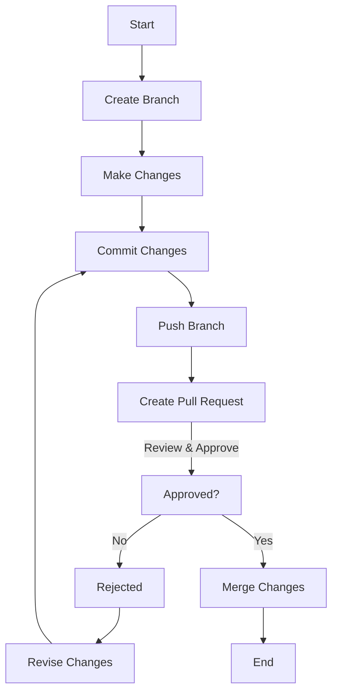

# Control Origins Repository

Welcome to the Company Documentation Repository! This repository is dedicated to storing and managing documentation for our company's various domains.

## Table of Contents

- [Introduction](#introduction)
- [Folder Structure](#folder-structure)
- [Contributing](#contributing)
- [License](#license)

## Introduction

This repository is designed to house documentation in Markdown (.md) format for different domains within our company. Markdown is a lightweight and easy-to-read markup language that all contributors should use when creating or editing documentation files. Markdown allows us to maintain consistent formatting and structure across all our documents.

## Folder Structure

We use a folder structure to organize documentation by domains or categories. Each domain will have its dedicated folder with relevant markdown files. Here is an example of the folder structure:
Please ensure that you place your documentation files in the appropriate folders to maintain organization.

## Contributing

We encourage all employees to contribute to the documentation repository. To contribute, follow these steps:

1. After creating a pull request (F), it goes through a review and approval process (G).
2. If the pull request is not approved (No), it is marked as "Rejected" (H).
3. The author revises the changes (I) and then commits and pushes the branch (D and E) to create a new pull request (F) for review.
4. If the pull request is approved (Yes), the changes are merged (J) into the main document.
5. Finally, the workflow ends (K) after the changes are merged.

This diagram visualizes the workflow for both approved and rejected pull requests, as well as the process of revising changes when a pull request is rejected.
By contributing to this repository, you agree that all files you create or modify remain the property of Control Origins.

## License

All documentation in this repository is proprietary and confidential to Control Origins. 
Unauthorized distribution or sharing of the documentation is strictly prohibited.
