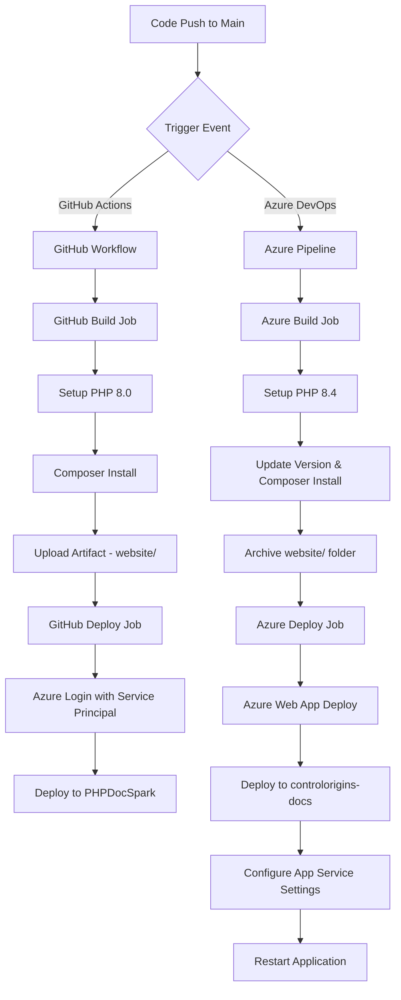

# CI/CD Pipeline Documentation - PHPDocSpark

## Overview

PHPDocSpark uses a comprehensive CI/CD pipeline to automate the build, test, and deployment process. The project maintains two parallel deployment pipelines:

1. **GitHub Actions** - Deploys to Azure Web App `PHPDocSpark`
2. **Azure DevOps Pipelines** - Deploys to Azure Web App `controlorigins-docs`

Both pipelines follow similar patterns but target different Azure environments, providing redundancy and flexibility for deployment strategies.

## Pipeline Architecture



## GitHub Actions Pipeline

### Configuration File

**Location**: `.github/workflows/main_phpdocspark.yml`

### Trigger Events

- Push to `main` branch
- Manual trigger via `workflow_dispatch`

### Build Stage

#### Build Environment

- **Runner**: `ubuntu-latest`
- **PHP Version**: `8.0`
- **Permissions**: `contents: read`

#### Build Steps

1. **Code Checkout**

   ```yaml
   - uses: actions/checkout@v4
   ```

2. **PHP Setup**

   ```yaml
   - name: Setup PHP
     uses: shivammathur/setup-php@v2
     with:
       php-version: '8.0'
   ```

3. **Dependency Management**

   ```yaml
   - name: Check if composer.json exists and run composer install
     run: |
       if [ -f "composer.json" ]; then
         echo "composer.json exists, running composer commands..."
         composer validate --no-check-publish && composer install --prefer-dist --no-progress
       else
         echo "composer.json not found, skipping composer install"
       fi
   ```

4. **Artifact Creation**

   ```yaml
   - name: Upload artifact for deployment job
     uses: actions/upload-artifact@v4
     with:
       name: php-app
       path: website/
   ```

### Deployment Stage

#### Deployment Environment

- **Runner**: `ubuntu-latest`
- **Dependencies**: Requires successful build stage
- **Permissions**:
  - `id-token: write` (JWT authentication)
  - `contents: read` (artifact download)

#### Deploy Steps

1. **Artifact Download**

   ```yaml
   - name: Download artifact from build job
     uses: actions/download-artifact@v4
     with:
       name: php-app
   ```

2. **Azure Authentication**

   ```yaml
   - name: Login to Azure
     uses: azure/login@v2
     with:
       client-id: ${{ secrets.AZUREAPPSERVICE_CLIENTID_... }}
       tenant-id: ${{ secrets.AZUREAPPSERVICE_TENANTID_... }}
       subscription-id: ${{ secrets.AZUREAPPSERVICE_SUBSCRIPTIONID_... }}
   ```

3. **Application Deployment**

   ```yaml
   - name: 'Deploy to Azure Web App'
     uses: azure/webapps-deploy@v3
     with:
       app-name: 'PHPDocSpark'
       slot-name: 'Production'
       package: .
   ```

## Azure DevOps Pipeline

### Azure Pipeline Configuration

**Location**: `azure-pipelines.yml`

### Azure Pipeline Triggers

- Push to `main` branch

### Azure Variables

```yaml
variables:
  azureSubscription: '0a93a597-8a82-4b6f-b7b0-8fd6c348949b'
  webAppName: 'controlorigins-docs'
  vmImageName: 'ubuntu-latest'
  environmentName: 'controlorigins-docs'
  rootFolder: $(System.DefaultWorkingDirectory)
```

### Azure Build Stage

#### Azure Build Environment

- **Runner**: `ubuntu-latest`
- **PHP Version**: `8.4`

#### Azure Build Process

1. **PHP Version Configuration**

   ```bash
   sudo update-alternatives --set php /usr/bin/php$(phpVersion)
   sudo update-alternatives --set phar /usr/bin/phar$(phpVersion)
   sudo update-alternatives --set phpdbg /usr/bin/phpdbg$(phpVersion)
   sudo update-alternatives --set php-cgi /usr/bin/php-cgi$(phpVersion)
   sudo update-alternatives --set phar.phar /usr/bin/phar.phar$(phpVersion)
   ```

2. **Version Information Update**

   ```bash
   node scripts/update-version.js
   ```

3. **Composer Install**

   ```bash
   composer install --no-interaction --prefer-dist
   ```

4. **Archive Creation**

   ```yaml
   - task: ArchiveFiles@2
     displayName: 'Archive files'
     inputs:
       rootFolderOrFile: '$(rootFolder)/website'
       includeRootFolder: false
       archiveType: zip
       archiveFile: $(Build.ArtifactStagingDirectory)/$(Build.BuildId).zip
       replaceExistingArchive: true
   ```

### Azure Deployment Stage

#### Azure Deployment Environment

- **Type**: Deployment job
- **Environment**: `controlorigins-docs`
- **Strategy**: `runOnce`

#### Azure Deploy Process

1. **Azure Web App Deployment**

   ```yaml
   - task: AzureWebApp@1
     displayName: 'Deploy Azure Web App : controlorigins-docs'
     inputs:
       azureSubscription: $(azureSubscription)
       appType: 'webAppLinux'
       appName: $(webAppName)
       package: $(Pipeline.Workspace)/drop/$(Build.BuildId).zip
   ```

2. **App Service Configuration**

   ```bash
   # Enable URL rewriting and configure PHP settings
   az webapp config appsettings set \
     --name $(webAppName) \
     --resource-group rg-controlorigins-docs \
     --settings \
       WEBSITE_DYNAMIC_CACHE=0 \
       WEBSITE_LOCAL_CACHE_OPTION=Never \
       PHP_INI_SCAN_DIR="/usr/local/etc/php/conf.d:/home/site" \
       WEBSITE_RUN_FROM_PACKAGE=0

   # Configure the router as startup file
   az webapp config set \
     --name $(webAppName) \
     --resource-group rg-controlorigins-docs \
     --startup-file "router.php" \
     --linux-fx-version "PHP|8.4"

   # Restart the app to apply settings
   az webapp restart \
     --name $(webAppName) \
     --resource-group rg-controlorigins-docs
   ```## Build Scripts

### Version Update Script

**Location**: `scripts/update-version.js`

**Purpose**: Updates version information during builds

**Features**:

- Reads version from `package.json`
- Extracts build number from environment variables (`BUILD_BUILDNUMBER`, `GITHUB_RUN_NUMBER`)
- Captures Git commit hash
- Generates timestamp
- Creates `website/includes/version.php` with build information

**Generated Functions**:

- `getSiteBuildInfo()`: Returns array of build information
- `getSiteVersionString()`: Returns formatted version string
- `getSiteBuildString()`: Returns full build information for display

### Build Script

**Location**: `scripts/build.js`

**Purpose**: Comprehensive build process with detailed logging

**Build Steps**:

1. **File Validation**: Checks for required source files
2. **Asset Cleaning**: Removes old assets from `website/assets/`
3. **Vite Build**: Runs Vite build process with real-time output
4. **Asset Copying**: Copies images and fonts to website directory
5. **Output Verification**: Validates generated files

**Features**:

- Colored console output with timestamps
- Error handling and detailed logging
- File size reporting
- Bootstrap Icons font copying

## Dependencies and Technologies

### PHP Dependencies (composer.json)

```json
{
  "require": {
    "php": "^8.0",
    "erusev/parsedown": "dev-master"
  }
}
```

### Frontend Dependencies (package.json)

**Production Dependencies**:

- Bootstrap 5.3.7
- Bootstrap Icons 1.13.1
- DataTables.net 2.3.2
- jQuery 3.7.1
- Prism.js 1.30.0

**Development Dependencies**:

- Vite 7.1.1
- ESLint 9.33.0
- Sass 1.90.0
- Prettier 3.6.2
- Husky 9.1.7

### Build Tools

- **Vite**: Frontend build tool and bundler
- **Node.js**: Build script execution (>=18.0.0)
- **Composer**: PHP dependency management
- **Git**: Version control and commit tracking

## Security Configuration

### GitHub Actions Secrets

- `AZUREAPPSERVICE_CLIENTID_*`: Azure Service Principal Client ID
- `AZUREAPPSERVICE_TENANTID_*`: Azure Tenant ID
- `AZUREAPPSERVICE_SUBSCRIPTIONID_*`: Azure Subscription ID

### Authentication Methods

- **GitHub Actions**: Uses Azure Service Principal with federated credentials
- **Azure DevOps**: Uses Azure Resource Manager service connection

## Deployment Targets

### PHPDocSpark (GitHub Actions)

- **Platform**: Azure Web App
- **Slot**: Production
- **Runtime**: PHP 8.0

### controlorigins-docs (Azure DevOps)

- **Platform**: Azure Linux Web App
- **Resource Group**: `rg-controlorigins-docs`
- **Runtime**: PHP 8.4
- **Custom Configuration**: Router-based URL rewriting

## Monitoring and Logging

### Build Artifacts

- **GitHub Actions**: Uploads `website/` folder as `php-app` artifact
- **Azure DevOps**: Creates ZIP archive with build ID naming

### Error Handling

- **Composer validation**: Validates `composer.json` before installation
- **Conditional execution**: Skips steps if dependencies are missing
- **Detailed logging**: Comprehensive error reporting in build scripts
- **Graceful degradation**: Continues deployment even if configuration steps fail

## Environment-Specific Configurations

### App Service Settings (controlorigins-docs)

```bash
WEBSITE_DYNAMIC_CACHE=0                    # Disable dynamic cache
WEBSITE_LOCAL_CACHE_OPTION=Never          # Disable local cache
PHP_INI_SCAN_DIR="/usr/local/etc/php/conf.d:/home/site"  # PHP configuration path
WEBSITE_RUN_FROM_PACKAGE=0                # Run from extracted files
```

### Startup Configuration

- **Startup File**: `router.php`
- **PHP Version**: 8.4 (Azure DevOps) / 8.0 (GitHub Actions)
- **Platform**: Linux-based App Service

## Best Practices Implemented

1. **Artifact Management**: Only deploys `website/` folder, excluding source code
2. **Version Tracking**: Automated version generation with build numbers and Git commits
3. **Environment Isolation**: Separate deployment targets for different pipelines
4. **Error Handling**: Comprehensive error checking and graceful failure handling
5. **Security**: Uses managed identities and service principals for authentication
6. **Caching Strategy**: Optimized caching settings for PHP applications
7. **Asset Optimization**: Vite-based frontend build with minification and bundling

## Troubleshooting Guide

### Common Issues

1. **Composer Install Failures**
   - Check PHP version compatibility
   - Verify `composer.json` syntax
   - Ensure all dependencies are available

2. **Deployment Authentication Failures**
   - Verify service principal credentials
   - Check Azure subscription access
   - Validate tenant and client IDs

3. **App Service Configuration Issues**
   - Check resource group permissions
   - Verify app service name and resource group
   - Monitor Azure CLI command outputs

4. **Build Script Failures**
   - Verify Node.js version (>=18.0.0)
   - Check for missing source files
   - Validate Vite configuration

### Debug Commands

```bash
# Check PHP version and modules
php -v && php -m

# Validate composer.json
composer validate

# Test Vite build locally
npm run build

# Check Azure CLI authentication
az account show

# Test app service configuration
az webapp config show --name <app-name> --resource-group <rg-name>
```

## Future Improvements

1. **Testing Integration**: Add automated testing stages
2. **Performance Monitoring**: Implement application performance monitoring
3. **Blue-Green Deployment**: Utilize Azure deployment slots for zero-downtime deployments
4. **Security Scanning**: Add vulnerability scanning to build process
5. **Multi-Environment**: Implement staging environments
6. **Rollback Capability**: Enhanced rollback mechanisms for failed deployments

---

**Last Updated**: August 2025  
**Document Version**: 1.0  
**Pipeline Version**: GitHub Actions v4, Azure DevOps v1
